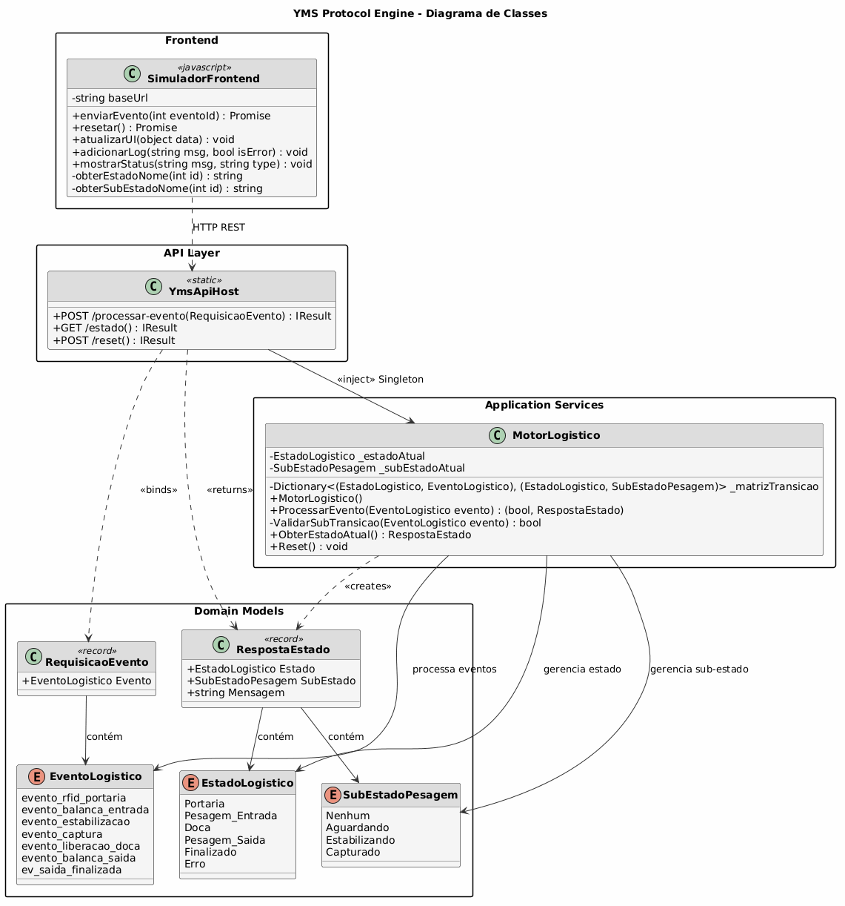
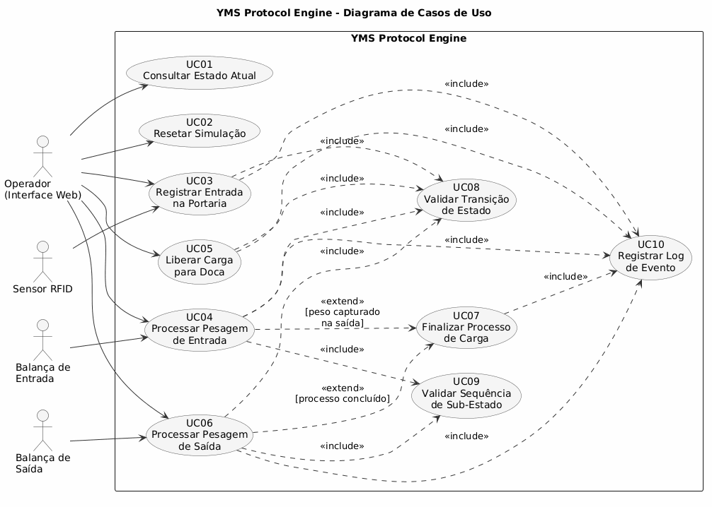

# YMS Protocol Engine

Sistema de gerenciamento de pátio (Yard Management System) implementado como um Autômato Finito Determinístico (DFA) com estados hierárquicos, desenvolvido em ASP.NET Core 10.0.

---

## Visao Geral

O projeto simula o fluxo logístico completo de cargas em um armazém: desde a entrada pela portaria com leitura de RFID, passando por duas etapas de pesagem (entrada e saída), armazenamento em doca, até a finalização do processo. A lógica de controle é modelada formalmente como um DFA, garantindo determinismo e rastreabilidade em cada transição de estado.

---

## Arquitetura

### Fundamento Teorico

O sistema é definido pela 5-tupla formal de um Autômato Finito Determinístico:

```
M = (Q, Σ, δ, q0, F)
```

| Componente | Definicao |
|---|---|
| **Q** | {Portaria, Pesagem_Entrada, Doca, Pesagem_Saida, Finalizado, Erro} |
| **Σ** | {evento_rfid_portaria, evento_balanca_entrada, evento_estabilizacao, evento_captura, evento_liberacao_doca, evento_balanca_saida, ev_saida_finalizada} |
| **δ** | Funcao de transicao implementada como dicionario de tuplas |
| **q0** | Portaria |
| **F** | {Finalizado} |

### Tabela de Transicao (δ)

| Estado Atual | Evento | Proximo Estado | Sub-Estado |
|---|---|---|---|
| Portaria | evento_rfid_portaria | Pesagem_Entrada | Aguardando |
| Pesagem_Entrada | evento_balanca_entrada | Pesagem_Entrada | Estabilizando |
| Pesagem_Entrada | evento_estabilizacao | Pesagem_Entrada | Capturado |
| Pesagem_Entrada | evento_captura | Doca | Nenhum |
| Doca | evento_liberacao_doca | Pesagem_Saida | Aguardando |
| Pesagem_Saida | evento_balanca_saida | Pesagem_Saida | Estabilizando |
| Pesagem_Saida | evento_estabilizacao | Pesagem_Saida | Capturado |
| Pesagem_Saida | evento_captura | Finalizado | Nenhum |

### Stack Tecnologico

- **Backend:** ASP.NET Core 10.0 (Minimal API)
- **Frontend:** HTML5, JavaScript (Vanilla)
- **Linguagem:** C# 13
- **Comunicacao:** REST API com CORS habilitado
- **Ciclo de Vida do Servico:** Singleton (estado persistente entre requisicoes)

---

## Diagrama de Classes



O sistema e organizado em quatro camadas:

- **Domain Models:** Enums e records que definem o vocabulario do autômato (estados, eventos, sub-estados e tipos de comunicacao).
- **Application Services:** `MotorLogistico` encapsula a maquina de estados, a matriz de transicao e as duas camadas de validacao.
- **API Layer:** `YmsApiHost` expoe tres endpoints REST e injeta o `MotorLogistico` como Singleton.
- **Frontend:** `SimuladorFrontend` consome a API via HTTP e atualiza a interface em tempo real.

---

## Diagrama de Casos de Uso



### Atores

| Ator | Descricao |
|---|---|
| Operador (Interface Web) | Usuario humano que interage com o simulador via navegador |
| Sensor RFID | Dispositivo externo que dispara o evento de entrada na portaria |
| Balanca de Entrada | Sensor de peso que controla a pesagem no recebimento |
| Balanca de Saida | Sensor de peso que controla a pesagem na expedicao |

### Casos de Uso

| Identificador | Nome | Descricao |
|---|---|---|
| UC01 | Consultar Estado Atual | Recupera o estado e sub-estado correntes do autômato |
| UC02 | Resetar Simulacao | Retorna o sistema ao estado inicial (Portaria) |
| UC03 | Registrar Entrada na Portaria | Processa leitura de RFID e transiciona para pesagem de entrada |
| UC04 | Processar Pesagem de Entrada | Controla o ciclo de estabilizacao e captura do peso na entrada |
| UC05 | Liberar Carga para Doca | Confirma armazenamento na doca e prepara pesagem de saida |
| UC06 | Processar Pesagem de Saida | Controla o ciclo de estabilizacao e captura do peso na saida |
| UC07 | Finalizar Processo de Carga | Registra conclusao do fluxo logistico completo |
| UC08 | Validar Transicao de Estado | Verifica se o evento e valido para o estado atual na matriz delta |
| UC09 | Validar Sequencia de Sub-Estado | Verifica a ordem correta dos sub-estados durante pesagem |
| UC10 | Registrar Log de Evento | Persiste historico de eventos com timestamp na interface |

---

## Estrutura do Projeto

```
AUTOMATOYMS/
├── TrabalhoAutomatos.sln
├── YmsAutomato/
│   ├── Models.cs              # Enums, records e tipos de dominio
│   ├── MotorLogistico.cs      # Implementacao do DFA (motor principal)
│   ├── Program.cs             # Configuracao ASP.NET Core e endpoints REST
│   ├── appsettings.json
│   ├── Properties/
│   │   └── launchSettings.json
│   └── wwwroot/
│       ├── index.html         # Interface de simulacao
│       └── script.js          # Logica de comunicacao com a API
└── docs/
    └── diagrams/
        ├── class-diagram.png
        ├── class-diagram.puml
        ├── usecase-diagram.png
        ├── usecase-diagram.puml
        └── generate_diagrams.py
```

---

## API REST

### `POST /processar-evento`

Processa um evento e aplica a transicao de estado correspondente.

**Corpo da requisicao:**

```json
{ "evento": 0 }
```

| Valor | Evento |
|---|---|
| 0 | evento_rfid_portaria |
| 1 | evento_balanca_entrada |
| 2 | evento_estabilizacao |
| 3 | evento_captura |
| 4 | evento_liberacao_doca |
| 5 | evento_balanca_saida |
| 6 | ev_saida_finalizada |

**Resposta (200 OK):**

```json
{
  "estado": 1,
  "subEstado": 1,
  "mensagem": "Estado: Pesagem_Entrada | Sub-estado: Aguardando"
}
```

**Resposta (400 Bad Request):**

```json
{
  "estado": 0,
  "subEstado": 0,
  "mensagem": "Transicao invalida: Nao e possivel processar evento_balanca_entrada no estado Portaria."
}
```

---

### `GET /estado`

Retorna o estado atual sem alterar o autômato.

**Resposta (200 OK):**

```json
{
  "estado": 0,
  "subEstado": 0,
  "mensagem": "Estado: Portaria | Sub-estado: Nenhum"
}
```

---

### `POST /reset`

Reinicializa o autômato para o estado inicial.

**Resposta (200 OK):**

```json
{
  "estado": 0,
  "subEstado": 0,
  "mensagem": "Sistema resetado. Estado: Portaria | Sub-estado: Nenhum"
}
```

---

## Como Executar

### Pre-requisitos

- [.NET 10.0 SDK](https://dotnet.microsoft.com/download)

### Execucao

```bash
cd YmsAutomato
dotnet run
```

O servidor inicia em `http://localhost:5034`. Acesse a interface de simulacao abrindo esse endereco em um navegador.

### Regenerar Diagramas

Os diagramas podem ser regenerados a partir dos fontes PlantUML:

```bash
cd docs/diagrams
python generate_diagrams.py
```

Requer Python 3.x e conexao com a internet (utiliza o servidor publico PlantUML).

---

## Caracteristicas Principais

- **Determinismo:** Mesma entrada em mesmo estado produz sempre o mesmo resultado.
- **Estado persistente:** O `MotorLogistico` e registrado como Singleton no contêiner de injecao de dependencia, mantendo estado entre requisicoes HTTP.
- **Hierarquia de estados:** Sub-estados modelam o ciclo de estabilizacao das balancas sem introduzir estados paralelos no autômato principal.
- **Validacao em duas camadas:** A funcao `ProcessarEvento` consulta a matriz delta (primeira camada) e delega a `ValidarSubTransicao` para verificar a sequencia de sub-estados (segunda camada).
- **Interface reativa:** O frontend atualiza os cartoes de estado e o log de eventos em tempo real apos cada transicao.

---

## Licenca

Projeto academico. Consulte o repositorio original para informacoes de licenciamento.
